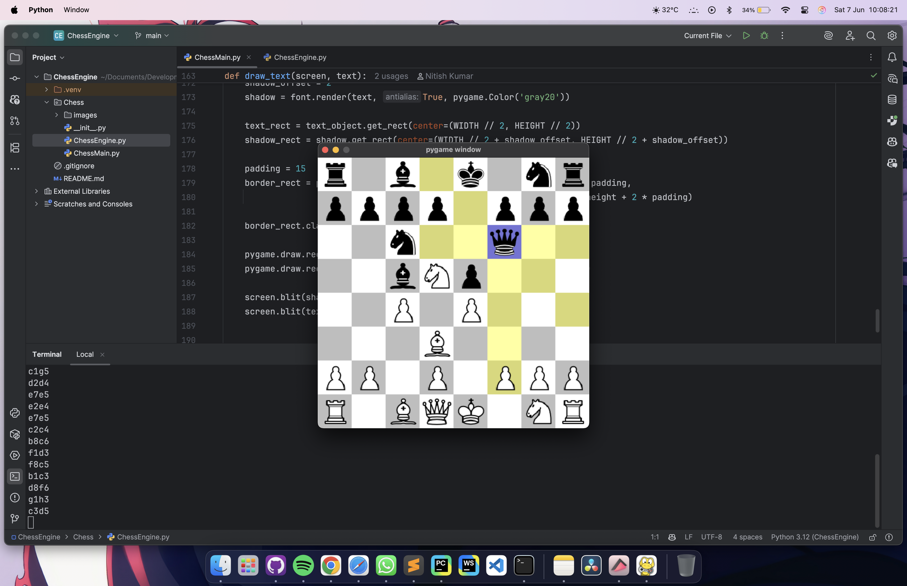
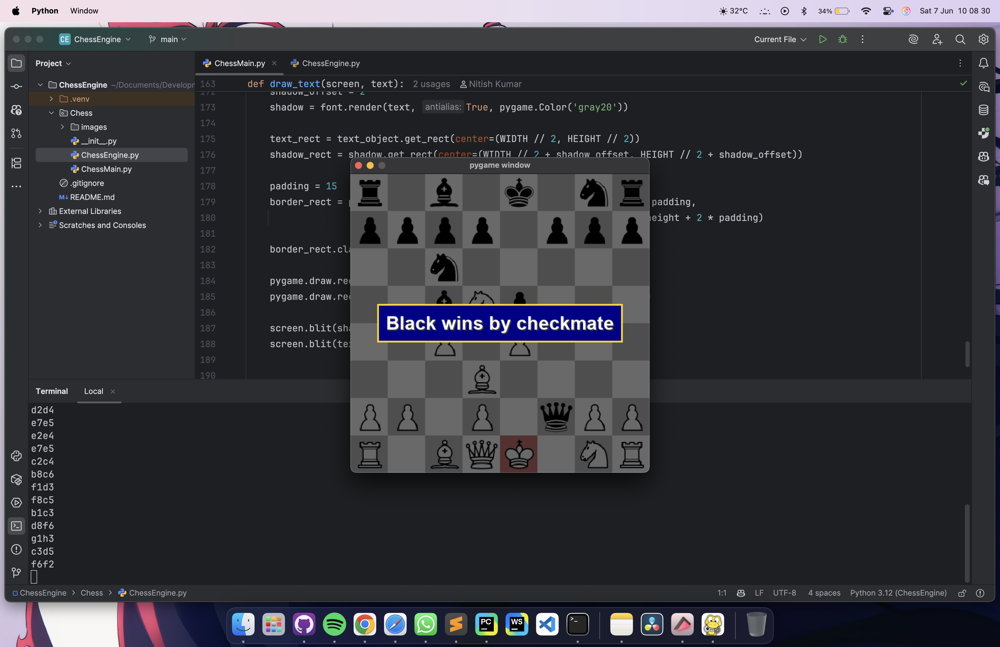

# ♟️ ChessEngine – A Python Chess Game with GUI

A fully functional chess game built with **Python** and **Pygame** — featuring interactive gameplay, animations, undo/reset, and check/checkmate detection. This project was created to deepen understanding of object-oriented programming and game development using Pygame.




---

## 🚀 Features

- ✅ Standard chess rules implemented (including check, checkmate, and stalemate)
- 🎮 Click-based move system: select a piece, then click on its destination
- 🔁 Undo last move with `Z` key
- ♻️ Restart the game anytime with `R` key
- 🎨 GUI built with Pygame — includes:
  - Board rendering and piece drawing
  - Smooth movement animations
  - Highlighting:
    - Selected square (`blue`)
    - Valid moves (`yellow`)
    - King in check (`red`)
- 🏁 Game Over screen with styled message overlay

---

## 🧠 Tech Stack

- **Language**: Python 3.12
- **Graphics**: Pygame 2.6.1
- **Design Pattern**: Object-Oriented Programming (OOP)

---

## 📁 Project Structure
ChessEngine/
├── Chess/
│   ├── __init__.py
│   ├── ChessMain.py
│   ├── ChessEngine.py
│   └── images/
│       ├── bB.png
│       ├── bK.png
│       ├── ...
│       ├── wR.png
│       ├── Moves.png
│       └── CheckMate.png
├── .gitignore
├── README.md
├── run.sh
└── .venv/  # (optional, for virtual environment)


---

## ▶️ How to Run

1. **Install dependencies**
   ```bash
   pip install pygame
    ```
2. **Run the game**
    ```bash
   python Chess/ChessMain.py
   ```